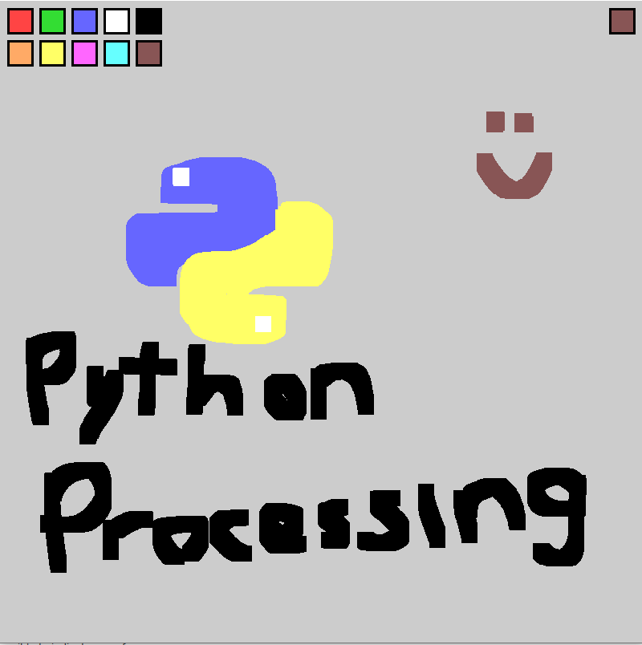

# PyProcessDraw
A minimal drawing application made with processing.py for an assignment.

### Assignment
The assignment should contain the following:
- Interaction between the user and the user-interface (made with Processing)
- Classes and objects for some of the program's data
- Pseudocode of a specific code portion
- Flowchart of a specific code portion
- Recursive datatype or function

---

### Details
I chose to create a drawing application because I've messed around with Processing.py and p5js before, and I've found out it's great for drawing.

- LMB to draw
- RMB to erase
- `c` to clear the screen
- `g` to go crazy

Increase brush size with arrow `up` and `down`

